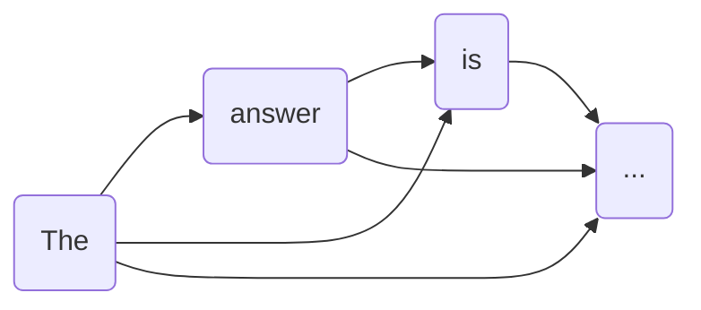

# Multiple choice questions


Here is LSAT question:

Give it a try, and do your best to explain your reasoning.

```md
<!-- highlight-start -->
John of Worcester, an English monk, recorded the sighting, on December 8, 1128, of two unusually large sunspots. Five days later a brilliant aurora borealis (northern lights) was observed in southern Korea. Sunspot activity is typically followed by the appearance of an aurora borealis, after a span of time that averages five days. Thus, the Korean sighting helps to confirm John of Worcester's sighting. Which one of the following, if true, most strengthens the argument?
<!-- highlight-end -->

a) An aurora borealis can sometimes occur even when there has been no significant sunspot activity in the previous week. 
b) Chinese sources recorded the sighting of sunspots more than 1000 years before John of Worcester did. 
c) Only heavy sunspot activity could have resulted in an aurora borealis viewable at a latitude as low as that of Korea. 
d) Because it is impossible to view sunspots with the naked eye under typical daylight conditions, the sighting recorded by John of Worcester would have taken place under unusual weather conditions such as fog or thin clouds. 
e) John of Worcester's account included a drawing of the sunspots, which could be the earliest illustration of sunspot activity.
```

<details>
<summary>The correct answer is ...</summary>
c) Only heavy sunspot activity could have resulted in an aurora borealis viewable at a latitude as low as that of Korea. 
</details>

Try copy pasting the problem into the playground verbatim. 

This **could** be a result:

```
e) John of Worcester's account included a drawing of the sunspots, which could be the earliest illustration of sunspot activity.
```

<details scheme='warning'>
<summary>Why is my answer different?</summary>
Notice that different executions could lead to different outputs. Text generation process has two components: a deterministic model that estimates different probabilities for different words, and a sampling process that selects a word. While the model is deterministic, the sampling process is not. 
</details>

The model likely failed. Does that mean the model is incapable for answering this type of question? Not necessarily. We will dive into techniques we can use to improve model results.

### The Magic Phrase
This is not the right answer, and gives little insight into the “reasoning” of the decision. We can try adding the phrase `let's explain step by step` like so:


```markdown
...
d) Because it is impossible to view sunspots with the naked eye under typical daylight conditions, the sighting recorded by John of Worcester would have taken place under unusual weather conditions such as fog or thin clouds. 
e) John of Worcester's account included a drawing of the sunspots, which could be the earliest illustration of sunspot activity.

Let’s explain step by step
```
This phrase will increase verbosity of the model. You might get output like this:


```
The argument is that John of Worcester's sighting of sunspots on December 8, 1128, was followed by the appearance of an aurora borealis (northern lights) in southern Korea five days later. This is evidence that sunspot activity is typically followed by the appearance of an aurora borealis. 

The correct answer is C. This is the most directly relevant piece of evidence. It supports the claim that sunspot activity can cause an aurora borealis, and it specifically mentions the kind of sunspot activity that would be necessary to cause an aurora borealis at the latitude of Korea.
```

This answer is correct, and the explanation given is reasonable. 


:::info
Our model is autoregressive: prior text, the original prompt text and additional model-generated text, affects the next output. In this case, the step-by-step keyword makes the model more verbose. The model may choose to summarize a question, or synthesize new information from the question before supplying an answer.

The specific term for this behavior is Chain of Thought: the model sequentially generates statements to reach an answer. This is similar to the concept of System 2 thinking (from Thinking Fast and Slow): the model defaults to system 1 thinking, but can chain system 1 thinking to arrive at a more methodological answer. 


:::

We can view the probabilities of the model like so:
We can obtain probabilities of each predictions through the “show probabilities” tab:

import PlayProbImage from '../assets/playground_probability_2.png';

<div style={{textAlign: 'center'}}>
  
</div>

Notice that probabilities at critical decision points are much lower, such as the word “irrelevant”. 


Another technique to increase consistency is to synthesize prompt templates for outputs that are effective. By guiding the model with a particular template, it is more likely to pattern match that particular mode. 

Here are some additional changes:

```
[Multiple choice data]
Let’s explain step by step for each answer choice.
1)
```

